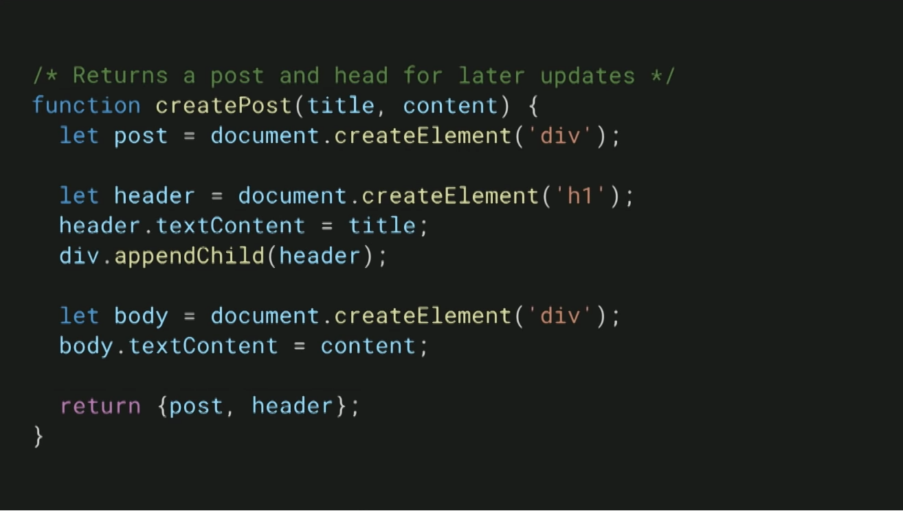
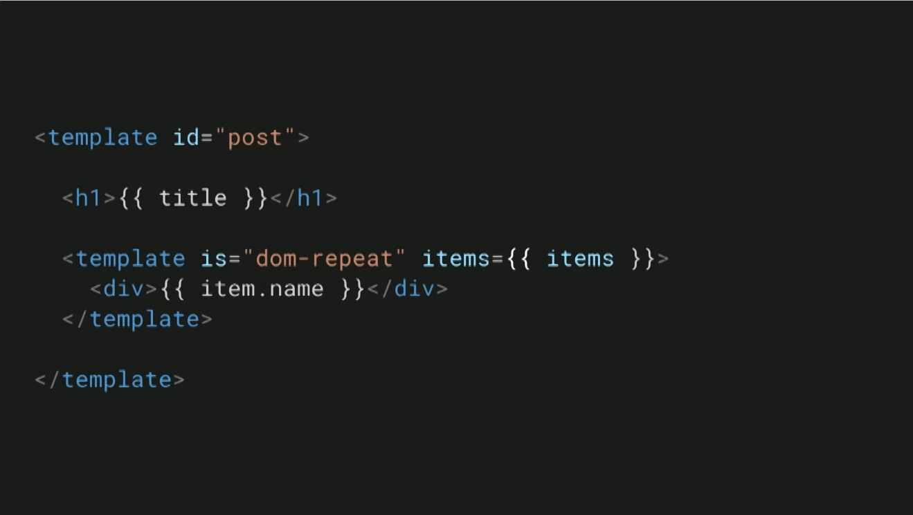

# Lit Elements & Lit Html

This repository has purpose to organize learning material and learnings about Lit Elements and Lit Html organized. It will have resources over web for future reading and will have inportant concepts noted down in a cleaner and simpler way.

___

## Index

- [An overview](#overview)
    - The changing web - Template system
    - Characterstics of the template system
- [Intro to Lit Html](#lit-html)
- [Code snippets](#code-snippets)
- [Best practices](#best-practices)
- [Libraries that uses Lit Element / Lit Html](#libraries-using-lit)
- [Resources Over Web](#resources)
- [To do list](#to-do)

___

## An overview<a name="overview"></a>

### The changing web - Template system

- Web uses HTML, a declarative document format. Can be used to design static web pages.
- Today, web pages we use are not all static. They have dynamic content. Then we need a `template system`
- `Templates` are critical part in today's web and either done on server side or client side.
- Maintaining this through our old friend `DOM manipulation` is very tricky and hard to maintain. See Fig-1
- `Template system` on other hand makes it very mainainable, readable. It is also very closer to the output.

**Fig 1: Example code snippet with manual DOM manipulation**



**Fig 2: Example code snippet with template system**



### Characterstics of the template system

It is good that template system is at our rescue, But it is incredibly hard to have a good template system

1. Developer experience
2. Boot fast
3. Update fast
4. Bridge JS & HTML

#### Developer experience

What strategy or way to use that looks seam less and easy to understand. `JSX` became very popular due to its seamless integration.

#### Boot fast

Time is directly related to real money, Now even seconds count.

#### Update fast

Data model should be sound enough to update/propogate the changes throughout. The faster the better.

#### Bridge JS & HTML

For most of the time it is very important how to bridge this gap. HTML contains views/template while JS contains the logic.

___

### Intro to Lit Html<a name="lit-html"></a>

- A library to write html templates into Javascript. 
- That boots and updates fast.
- Extremely small.
- Easy to use, extensible API.

#### Lit Html Template - Tag Template Literals

```javascript
// Example-1: How we write html template into javascript
html `
    <div>
        <h1>${title}</h1>
        <body>${content}</body>
    </div>
`;
```
If we see the example above, we note that

- It seems like a ES6  string template literal
- It has tag i.e. `html`

> `tag` is a special function that process the string template literal and javascript expressions for the value. Interesting, is it do not need to return string, it can return any type of value.

#### What value the tag will return?

- __String?__ If it will be string it will be very costly to update via innerHTML.
- __DOM?__ Entire `DOM tree` will be replaced/reconstructed.

> It returns the `templateResult`, It is reference to the template and data which will be used into the template. It can be seen as instruction to render the template it is not the template itself.

```javascript
// Example-1: How we write html template into javascript
let templateResult =
html `
    <div>
        <h1>${title}</h1>
        <body>${content}</body>
    </div>
`;

render(templateResult, container);
```
- We pass templateResult and container to the render function.
- First time it will tender the complete template, then only the updates.

#### So isn't it similar to react?

There are indeed some similarities but some differences too.

- `Lit Html` does not uses `JSX`, it uses plain javascript.
- `Lit Html` does not have concept of `virtual DOM`.
- There is one philosophical similarity though.

> At any given time UI is a pure function of state. For the given state UI generated will always be the same UI. Library take care of rendering.


___

## Code Snippets<a name="code-snippets"></a>

1. [A demo with LitElement (How it works)](./code-sandbox/lit-tutorial-example.md)


___

## Best Practices<a name="best-practices"></a>

1. <!-- link/list the best practices related to this -->

___

## Libraries that uses Lit Element/Lit Html<a name="libraries-using-lit"></a>

- [Sales force](https://developer.salesforce.com/blogs/2018/12/introducing-lightning-web-components.html)
- [StencilJS](https://stenciljs.com/)
- [SkateJS](https://skatejs.netlify.com/)
- [PolymerJS](https://polymer-library.polymer-project.org/)

___

## Resources Over Web<a name="resources"></a>

- [A nice introduction, Google Dev Summit 2017](https://youtu.be/Io6JjgckHbg)
- [Lit-Html, Github](https://github.com/web-padawan/awesome-lit-html)
- [Lit-Html, Polymer](https://lit-html.polymer-project.org/)
- [Lit-Element, Polymer](https://lit-element.polymer-project.org/)
- [Awesome-lit, Implementations](https://github.com/web-padawan/awesome-lit-html)
- [Lit-Element, Lit-Html - Google](https://developers.google.com/web/updates/2019/02/lit-element-and-lit-html)

___

## To do list<a name="to-do"></a>

1. Typescript course, as it will be using it.
2. Polymer 2/Polymer 3 to lit and vice versa.
3. Read more about ES6 Tag Template Literals.